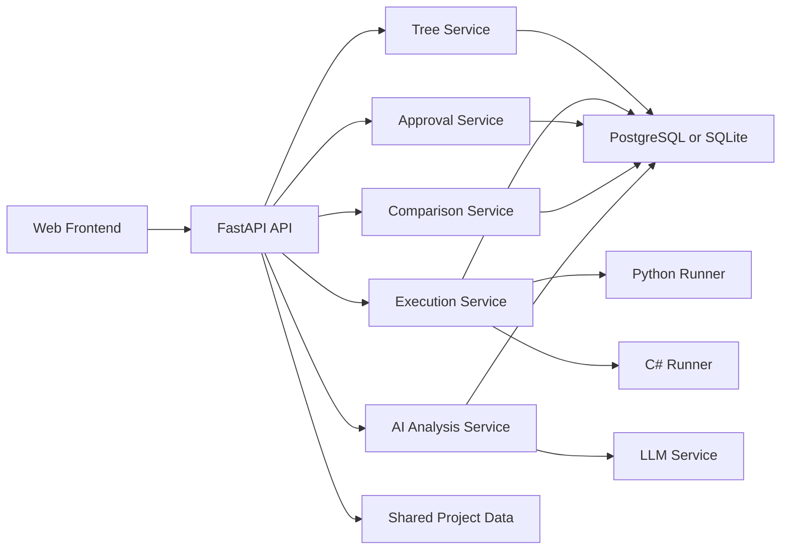
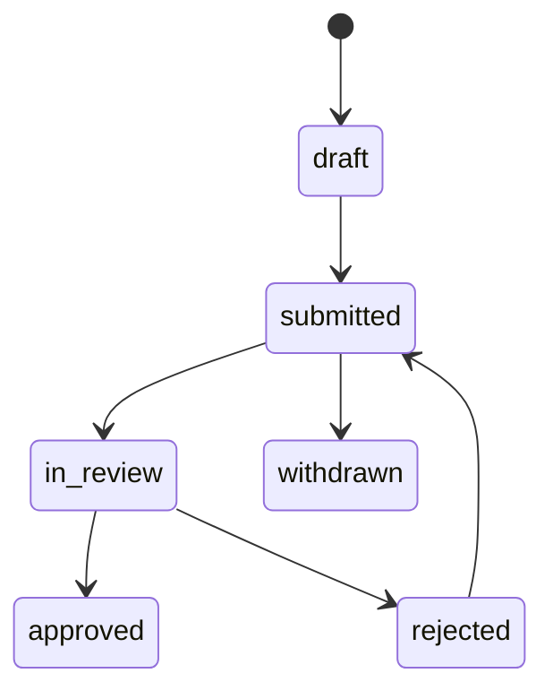

# 计算平台技术设计

## 1. 设计目标

本方案面向一套项目级计算平台，核心目标是把树形编排、双语言执行、审批流、横向对比和 AI 分析整合到同一个统一后端中，并与现有项目、用户、现场反馈、文件共享能力打通。

## 2. 总体架构



## 3. 分层设计

### 3.1 前端层

- 项目首页
- 名目与结构树页面
- 参数管理页面
- 计算步骤页面
- 执行与结果页面
- 审批页面
- 对比分析页面
- AI 分析页面

建议前端采用单页应用，结构树编辑器使用树组件加右键菜单加属性抽屉的组合方式。树页面负责可视化编辑，执行结果与审批状态通过侧边栏或底部面板呈现。

### 3.2 API 层

FastAPI 提供 REST API，按领域拆分为以下路由组：

- `/projects`
- `/project-items`
- `/tree`
- `/calc-steps`
- `/executions`
- `/approvals`
- `/comparisons`
- `/ai/analysis`

### 3.3 领域服务层

- `ProjectService`: 项目与名目聚合。
- `TreeService`: 节点增删改查、移动、复制、排序、版本化。
- `CalcStepService`: 步骤模板、语言元数据、输入输出定义。
- `ExecutionService`: 执行计划、上下文构建、结果写入。
- `ApprovalService`: 审批流转与日志。
- `ComparisonService`: 同类结果聚合与报表生成。
- `AiAnalysisService`: 上下文拼装、外部 AI 调用、结果存储。

### 3.4 执行器层

- `PythonExecutor`
- `CSharpExecutor`
- `ExecutorRegistry`

执行器层负责将统一的执行请求转换为语言特定运行方式，并返回标准化 JSON。

## 4. 数据模型设计

### 4.1 核心实体

#### Project

- `id`
- `name`
- `owner_user_id`
- `status`
- `shared_feedback_scope_id`
- `created_at`
- `updated_at`

#### ProjectItem

项目下的名目实体。

- `id`
- `project_id`
- `name`
- `code`
- `description`
- `created_at`
- `updated_at`

#### CalcNode

- `id`
- `project_id`
- `project_item_id`
- `parent_id`
- `name`
- `node_type` `folder|calc`
- `calc_step_id`
- `order_index`
- `path`
- `depth`
- `version_no`
- `metadata_json`
- `created_by`
- `created_at`
- `updated_at`

说明：`path` 用于提升树查询和子树移动效率，推荐采用物化路径表示法。

#### CalcStep

- `id`
- `name`
- `step_type`
- `language` `python|csharp`
- `entry_point`
- `script_content`
- `artifact_path`
- `output_schema_json`
- `timeout_seconds`
- `is_active`
- `created_at`
- `updated_at`

#### CalcInputRef

- `id`
- `calc_step_id`
- `input_name`
- `source_type` `global_param|project_param|node_result|file_meta|constant`
- `source_key`
- `source_node_id`
- `default_value`
- `transform_rule`

#### CalcExecution

- `id`
- `project_id`
- `project_item_id`
- `trigger_type` `single_node|tree`
- `root_node_id`
- `status` `pending|running|success|failed|partial_success|cancelled`
- `started_by`
- `started_at`
- `finished_at`

#### CalcResult

- `id`
- `execution_id`
- `node_id`
- `calc_step_id`
- `status` `pending|running|success|failed|approved|rejected`
- `input_snapshot_json`
- `output_json`
- `log_text`
- `error_text`
- `duration_ms`
- `executed_at`

#### ApprovalRequest

- `id`
- `project_id`
- `project_item_id`
- `target_type` `node|result|publish`
- `target_id`
- `current_stage`
- `status` `draft|submitted|in_review|approved|rejected|withdrawn`
- `submitted_by`
- `submitted_at`
- `closed_at`

#### ApprovalLog

- `id`
- `approval_request_id`
- `action` `submit|approve|reject|withdraw|comment`
- `stage_no`
- `actor_user_id`
- `comment`
- `created_at`

#### ComparisonGroup

- `id`
- `name`
- `step_type`
- `metric_config_json`
- `created_by`
- `created_at`

#### ComparisonItem

- `id`
- `comparison_group_id`
- `project_id`
- `project_item_id`
- `calc_step_id`
- `node_id`
- `result_id`

#### AiAnalysisRequest

- `id`
- `project_id`
- `project_item_id`
- `analysis_type`
- `context_scope_json`
- `input_payload_json`
- `status` `pending|running|success|failed`
- `requested_by`
- `requested_at`
- `finished_at`

#### AiAnalysisResult

- `id`
- `request_id`
- `summary`
- `diagnosis_text`
- `suggestions_json`
- `risk_flags_json`
- `raw_response_json`
- `created_at`

### 4.2 关联关系

- 一个 `Project` 包含多个 `ProjectItem`。
- 一个 `ProjectItem` 对应一棵或多版本 `CalcNode` 树。
- 一个 `CalcNode` 可绑定一个 `CalcStep`。
- 一个 `CalcStep` 包含多个 `CalcInputRef`。
- 一次 `CalcExecution` 产出多个 `CalcResult`。
- 一个 `ApprovalRequest` 关联一个审批目标并包含多个 `ApprovalLog`。
- 一个 `ComparisonGroup` 包含多个 `ComparisonItem`。
- 一个 `AiAnalysisRequest` 对应一个 `AiAnalysisResult`。

## 5. 结构树实现方案

### 5.1 存储策略

推荐使用物化路径加排序字段：

- `path` 示例：`/1/4/15`
- `depth` 表示层级
- `order_index` 表示同级排序

优势：

- 查询整棵树和子树简单
- 节点移动逻辑清晰
- 兼容 PostgreSQL 和 SQLite

### 5.2 节点复制与移动

- 复制：复制子树结构并清空运行结果关联。
- 移动：更新目标节点的 `parent_id`、`path`、`depth` 和受影响子树路径。
- 删除：采用逻辑删除字段，保留审计与历史结果关联。

### 5.3 版本策略

结构树支持草稿与发布态：

- 草稿可持续编辑
- 提审后冻结当前版本
- 审批通过后形成可执行版本

## 6. 执行引擎设计

### 6.1 执行流程

1. 接收执行请求。
2. 查询目标树版本和节点集合。
3. 校验节点绑定、参数完整性和审批状态。
4. 生成拓扑有序执行计划。
5. 为每个计算节点构建执行上下文。
6. 通过 `ExecutorRegistry` 选择语言执行器。
7. 接收标准化结果并持久化。
8. 汇总整次执行状态。

### 6.2 上下文结构

```json
{
  "project": {"id": 1, "name": "示例项目"},
  "project_item": {"id": 10, "name": "名目A"},
  "node": {"id": 100, "name": "换热计算"},
  "params": {"temperature": 120},
  "upstream_results": {"node_90": {"pressure": 0.3}},
  "shared_files": [{"file_id": 1, "name": "input.xlsx"}],
  "feedback_context": [{"source": "onsite", "content": "现场温差偏大"}]
}
```

### 6.3 执行器接口

```python
class BaseExecutor(Protocol):
    def execute(self, step: CalcStep, context: dict) -> dict:
        ...
```

标准返回结构：

```json
{
  "status": "success",
  "outputs": {"efficiency": 0.92},
  "logs": ["start", "done"],
  "metrics": {"duration_ms": 128}
}
```

### 6.4 Python 执行器

建议采用受控子进程执行，而不是直接在 API 进程中 `exec` 用户脚本。实现方式：

- 将 `script_content` 写入临时文件
- 通过独立 Python worker 进程执行
- 通过 stdin 传入上下文 JSON
- 通过 stdout 返回结果 JSON
- 结合超时与资源限制

收益：

- 服务进程更稳定
- 更容易限制超时和异常
- 更方便后续升级到容器隔离

### 6.5 C# 执行器

建议统一采用外部进程模式：

- 对可执行文件：直接调用 `dotnet <dll>` 或可执行程序
- 对程序集：约定统一入口命令适配器
- 通过 stdin 输入上下文 JSON
- 通过 stdout 输出结果 JSON

### 6.6 异步任务机制

整树执行和 AI 分析都建议异步化。可以先采用数据库任务表加后台 worker 的轻量模式，后续再迁移到 Celery 或消息队列。

## 7. 审批流设计

### 7.1 审批对象

- 节点结构版本
- 计算结果
- 发布动作

### 7.2 状态机



### 7.3 规则策略

- 基础版采用固定多级审批链。
- 审批链按项目类型或步骤类型配置。
- 审批通过后结果状态更新为 `approved`。
- 审批中的版本默认冻结编辑权限。

## 8. 对比分析设计

### 8.1 对比维度

- 相同 `step_type`
- 相同指标键
- 同一项目不同时间点
- 不同项目同一名目类别

### 8.2 报表结构

- 结果明细表
- 指标对比表
- 时间序列趋势
- 导出文件

### 8.3 数据提取策略

以 `CalcResult.output_json` 为统一结果来源，结合 `ComparisonGroup.metric_config_json` 提取关键指标。指标配置示例：

```json
{
  "metrics": [
    {"key": "efficiency", "label": "效率", "unit": "%"},
    {"key": "pressure_drop", "label": "压降", "unit": "kPa"}
  ]
}
```

## 9. AI 分析设计

### 9.1 输入上下文

AI 输入由以下部分组成：

- 项目基础信息
- 名目信息
- 树结构摘要
- 关键参数
- 最近一次或指定结果集
- 共享文件摘要
- 现场反馈摘要
- 用户分析指令

### 9.2 服务边界

`AiAnalysisService` 负责：

- 拉取与裁剪上下文
- 组装统一 prompt payload
- 调用模型服务
- 存储结构化分析结果

建议 AI 接口采用同步创建加异步查询模型，避免长请求阻塞 API。

### 9.3 返回结构

```json
{
  "summary": "换热效率偏低，建议检查入口温度与压降配置",
  "diagnosis": "主要问题集中在上游压力波动和参数缺失",
  "suggestions": [
    "补充入口压力采样点",
    "复核节点 B3 的默认参数"
  ],
  "risk_flags": ["missing_param", "abnormal_trend"]
}
```

## 10. API 设计

### 10.1 项目与名目

- `GET /projects`
- `POST /projects`
- `GET /projects/{id}`
- `PUT /projects/{id}`
- `GET /projects/{id}/items`
- `POST /projects/{id}/items`

### 10.2 结构树

- `GET /projects/{id}/items/{item_id}/tree`
- `POST /projects/{id}/items/{item_id}/tree/nodes`
- `PUT /tree/nodes/{node_id}`
- `POST /tree/nodes/{node_id}/move`
- `POST /tree/nodes/{node_id}/copy`
- `DELETE /tree/nodes/{node_id}`

### 10.3 参数

- `GET /params/global`
- `POST /params/global`
- `POST /params/global/import`
- `GET /projects/{project_id}/params`
- `POST /projects/{project_id}/params`
- `POST /projects/{project_id}/params/import`

### 10.4 计算步骤与执行

- `GET /calc-steps`
- `POST /calc-steps`
- `PUT /calc-steps/{id}`
- `POST /calc-steps/{id}/run`
- `POST /projects/{project_id}/items/{item_id}/run-tree`
- `GET /executions/{id}`
- `GET /executions/{id}/results`

### 10.5 审批

- `POST /approvals`
- `GET /approvals`
- `GET /approvals/{id}`
- `POST /approvals/{id}/approve`
- `POST /approvals/{id}/reject`
- `POST /approvals/{id}/withdraw`

### 10.6 对比

- `GET /comparisons/groups`
- `POST /comparisons/groups`
- `GET /comparisons/groups/{id}`
- `POST /comparisons/groups/{id}/items`
- `GET /comparisons/groups/{id}/report`

### 10.7 AI 分析

- `POST /ai/analysis`
- `GET /ai/analysis/{id}`
- `GET /ai/analysis?project_id={project_id}`

## 11. 权限与审计

建议按角色控制以下能力：

- 管理员：全量配置权限
- 项目负责人：项目、结构树、执行、提审权限
- 计算工程师：步骤维护、调试执行权限
- 审批人：审批查看与处理权限
- 分析人员：对比和 AI 分析查看权限

审计对象：

- 结构树变更
- 步骤变更
- 执行记录
- 审批记录
- AI 分析请求与结果

## 12. 集成方案

### 12.1 与现有项目和用户共享

- 复用现有 `Project` 与 `User` 主数据。
- 计算平台通过外键或领域服务接入现有项目体系。

### 12.2 与现场反馈模块共享

- 通过项目维度关联现场反馈记录。
- AI 分析读取项目关联反馈摘要。

### 12.3 与文件共享能力集成

- 项目文件通过统一文件表或文件服务暴露元数据。
- 执行和 AI 分析共享相同文件引用能力。

## 13. 实施阶段

### 阶段一：基础能力

- 项目名目管理
- 树结构管理
- 参数管理
- Python 单语言执行
- 结果存储与展示

### 阶段二：双语言执行

- C# 执行器
- 执行上下文标准化
- 异步执行任务

### 阶段三：审批流

- 审批请求与日志
- 结果审批状态控制
- 树版本提审

### 阶段四：对比分析

- `step_type` 归类
- 对比组、指标配置、导出

### 阶段五：AI 分析

- 上下文聚合
- 模型调用
- 分析结果结构化展示

## 14. 风险与建议

### 14.1 主要风险

- 用户脚本执行带来运行安全风险
- 双语言结果格式不统一带来对比困难
- 结构树频繁编辑带来版本一致性风险
- AI 上下文过大带来性能与成本压力

### 14.2 对策

- 执行器统一 stdout JSON 协议与超时限制
- 结果 Schema 明确化
- 树版本草稿与发布分离
- AI 上下文分层裁剪并做摘要化

## 15. 推荐实现结论

我建议采用“FastAPI + SQLAlchemy + PostgreSQL + 异步 worker + 外部进程执行器”的架构，先完成树、参数、Python 执行与结果闭环，再逐步叠加 C#、审批、对比和 AI 模块。这个方案实现路径清晰，兼顾当前落地速度和后续扩展空间。
